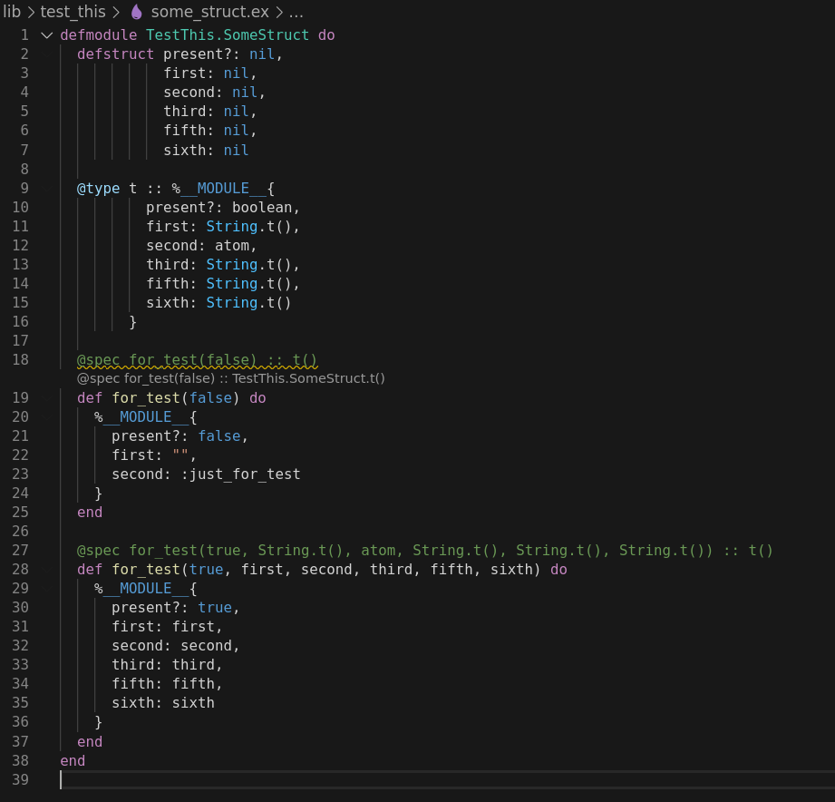

# Documenting unusual static analysis warnings from Dialyzer when using Elixir



``` sh
elixir --version
```
~~~
Erlang/OTP 23 [erts-11.0.3] [source] [64-bit] [smp:8:4] [ds:8:4:10] [async-threads:1]

Elixir 1.10.3 (compiled with Erlang/OTP 22)
~~~
